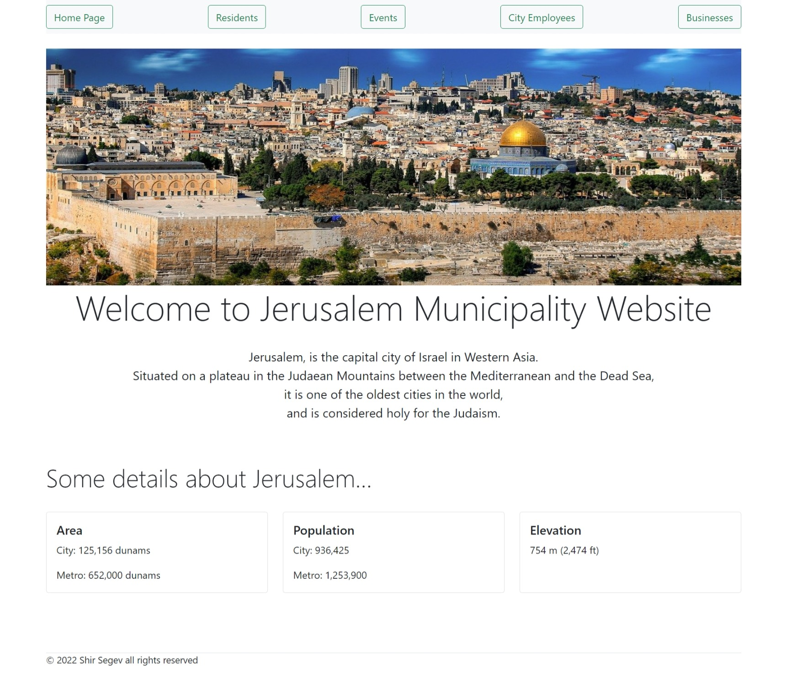

# **Jerusalem Municipality Website**

Bonus project in Angular course.

This website is Jerusalem Municipality Website.

#

## Homepage

This page has navbar, short brief and some details about Jerusalem

- This is a 5 page website: homepage, residents, events, city employees and businesses.

 

## Residents Page

This page has all the residents of Jerusalem and their details.

- by clicking the Edit button the user will be able to edit the resident details.

 

## Resident Edit Details Page

In this page the user can edit the resident details

 

## Events List Page

In this page there is a table of all the events in Jerusalem and some details

- There is a edit button in every row which would give the user the ability to edit the event user
- Red row - means less that 30 participants in the event
- Yellow row - means less than 100 participants and more than 30 participants in the event
- Green row - means more than 100 participants in the event

 

## Event Edit Details Page

In this page the user can edit the event details

 

## Employee List Page

In this page there is a table of all the employee of Jerusalem municipality and their details

- Red row - means that this employee is getting payed **less** than 3000 shekels per month
- Blue row - means that this employee is getting payed **more** than 3000 shekels per month

 

## Businesses List Page

In this page there is a table of the businesses in Jerusalem and some details

- Red row - means that the average monthly profit of this business is **less** than 5000 shekels
- Blue row - means that the average monthly profit of this business is **more** than 5000 shekels

 

### **To Run This Project**

write in terminal `npm i` and than, `ng serve -o`. The website will reload automatically in `http://localhost:4200/` by default, in your browser

 

#

&copy; 2022 Shir Segev all rights reserved
